```{r setup, include = FALSE}
options(htmltools.dir.version = FALSE)
knitr::opts_chunk$set(message = FALSE, warning = FALSE, fig.align = "center")
xaringanExtra::use_tachyons()
xaringanExtra::use_tile_view()
```

# Contexto...

```{r, echo = FALSE, eval = TRUE, fig.asp = 2/2, out.width = "100%", fig.align = "center"}
knitr::include_graphics("./img/01_MonoFRA.jpg")
```

<br>

Cualquier ejercicio de accesibilidad (geográfica) tiene (al menos) 3 patas:

1. un **origen** por parte de quien accede,

1. una **ruta**, por algún medio de trasporte determinado, y

1. un **destino** al centro donde se accede.

--

Ya vimos como geocodificar destinos. ¡Como empezamos la casa por el tejado!, seguimos ahora con la determinación de la ruta para un **origen dado**. 

¡En realidad solo estaremos interesados en distancias y tiempos de viaje!

---

# Preliminares (1/2)

Los problemas de rutas pueden ser extremadamente complejos.

Si queremos ir de _A_ a _B_, ¿como queremos ir?

En coche, a pie, en bicicleta, en tren, en barco &ndash;¿es posible?&ndash;, en avión.

¿En un único medio de transporte o combinando varios?

¿Podemos ir en línea recta o debemos utilizar una red?

Nos interesa solo la distancia y el tiempo aproximado que tardaremos, o queremos saber los puntos de paso, es decir la **ruta**.

--

¡Debemos ser específicos sobre todas estas cuestiones **antes** de empezar!

---

# Preliminares (2/2)

Normalmente no podremos ir en linea recta, de forma que **necesitaremos una red de transporte**.

--

Si solo vamos a utilizar un modo de transporte tenemos un problema de **red unimodal**, y solo necesitaremos la red del modo de transporte correspondiente, la red de carreteras o de ferrocarril.

--

Si vamos a utilizar varios modos de transporte tenemos un problema de **red multimodal**, y necesitaremos los puntos de intercambio.

--

Si **no** somos autónomos en el medio de transporte elegido &ndash;coche, bicicleta, a pie,...&ndash; deberemos disponer de las frecuencias de paso y los puntos de parada.

--

Nuestro ejercicio lo simplifica todo al máximo. Queremos conocer la **distancia** y el **tiempo de viaje** aproximado entre dos puntos concretos en **coche privado** utilizando la **red de carreteras**.

--

**¡Recordar!** Las distancias son siempre más fiable que los tiempos de viaje, puesto que las primeras son algo físico, que se miden sobre la red, mientras que los segundos dependen de supuestos sobre velocidades del medio de transporte y las condiciones de tráfico.

---

### Retomamos el problema donde lo dejamos...

```{r echo = FALSE, out.width = "100%", fig.height = 6, eval = require("leaflet")}
IvieIcon <- makeIcon(iconUrl = "https://www.ivie.es/wp-content/uploads/2017/02/logo.jpg",
                     iconWidth = 45, iconHeight = 25,
                     iconAnchorX = 15, iconAnchorY = 25)

Oficinas <- sf::read_sf("./data/Oficinas2020geoIvie.gpkg") %>%
  sf::st_transform(crs = 4326)

route <- osrm::osrmRoute(src = c(-0.3559, 39.4805), dst = Oficinas[188, ], returnclass = "sf", osrm.profile = "foot")
leaflet() %>% addTiles() %>% setView(lng = -0.3594, lat = 39.4805, zoom = 16) %>%
  addMarkers(lng = -0.3559, lat = 39.4805, icon = IvieIcon) %>%
  addMarkers(data = Oficinas, clusterOptions = markerClusterOptions(), popup = Oficinas$Entidad) %>%
  addPolylines(data = route, color = "red") %>%
  addLabelOnlyMarkers(lng = -0.3587, lat = 39.4807, label = "1km & 12m", labelOptions = labelOptions(noHide = TRUE,
                      textOnly = TRUE, style = list("color" = "red"), textsize = "12px"))
```

---

# _CRS: Coordinate Reference Systems_

La información geográfica siempre está necesariamente ligada a un **Sistema de Referencia de Coordenadas (_CRS_)**. Hay básicamente 2 grupos de _CRS_.

--

.pull-left[
**Geográficos**

```{r, echo = FALSE, eval = TRUE, fig.asp = 2/2, out.width = "80%", fig.align = "center"}
knitr::include_graphics("./img/vector_lonlat.png")
```

]

--

.pull-right[
**Proyectados**

```{r, echo = FALSE, eval = TRUE, fig.asp = 2/2, out.width = "80%", fig.align = "center"}
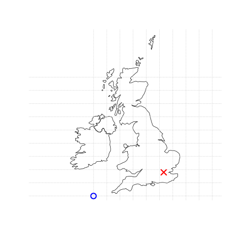
```

]

--

**IMPORANTE:** Siempre que trabajemos con información geográfica debemos asegurarnos que **toda la información** está en el **mismo _CRS_**.


???

Afortunadamente los servicios que utilizaremos se encargarán de gran parte de estas cosas y nosotros no tendremos que preocuparnos.

---

class: inverse, center, middle

# Get Started

---

# Problema real

Disponemos del fichero de Oficinas bancarias de diciembre de 2020 del Banco de España georeferenciado y queremos estimar la **distancia** y el **tiempo** de acceso de **cada municipio** a la **oficina más cercana**.

--

**Importante:** Las distancias se miden entre puntos, por tanto el municipio es un punto, la coordenada de la capital. Implicitamente suponemos que la población está concentrada en ese punto.

--

¿Cual es la dimensión de nuestro problema?

**Origenes:** 8 131 municipios.

**Destinos:** 22 558 oficinas.

--

La matriz de **O**rigen-**D**estino (OD) tiene 183 419 098 celdas.

¡Debemos calcular más de 183 millones de rutas y elegir la óptima para cada municipio!

--

Claramente debemos reducir la dimensión de nuestro problema.

---

# Problemas a resolver

Tenemos, pues, 2 problemas a resolver:

--

1. Dados dos puntos debemos calcular la **ruta óptima** (menor distancia/tiempo).

--

1. Debemos **acotar** el conjunto de **candidatos posibles** para el calculo de rutas hasta una dimensión razonable. 

--

¡Como siempre empezamos por el final!

--

<br>

Acotar el conjunto de oficinas candidatas a las más cercanas de un municipio puede hacerse mediante lo que en _GIS_ se conoce como determinación de **áreas de influencia**, ¡y naturalmente no hay una forma única de hacerlo!

---

# ¿Áreas de influencia?

- Si **no disponemos de la red** es posible dividir, de forma **óptima**<sup>*</sup>, el territorio en tantos poligonos como destinos tengamos &ndash;oficinas en nuestro caso&ndash; y asignar los orígenes a dichos polígonos. Una forma de hacer esto es la [teselación de Voronoi](http://alexbeutel.com/webgl/voronoi.html) ([sf::st_voronoi](https://r-spatial.github.io/sf/reference/geos_unary.html)).

.footnote[(*) Por óptima entendemos que las lineas que determinan los polígonos son equidistantes a los puntos.]

--

```{r, echo = FALSE, eval = TRUE, fig.asp = 2/2, out.width = "45%", fig.align = "center"}
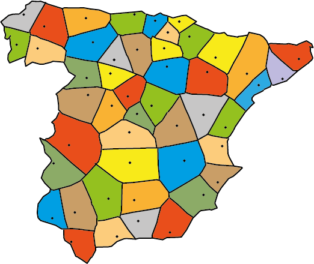
```

---

# ¿Áreas de influencia?

- ¿Otros métodos? **Si**. Incluso si seguimos **sin disponer de la red**.

```{r echo = FALSE, out.width = "100%", fig.height = 6}
leaflet(Oficinas) %>% addTiles() %>% setView(lng = -0.3559, lat = 39.4805, zoom = 15) %>%
  addMarkers(popup = ~ Entidad) %>%
  addMarkers(lng = -0.3559, lat = 39.4805, icon = IvieIcon) %>%
  addCircles(lng = -0.3559, lat = 39.4805, radius = 600)
```


---

# ¿Áreas de influencia?

- **Si disponemos de la red** podemos afinar el método anterior. Podemos trazar un polígono a partir de los ejes de la red.

--

```{r, echo = FALSE, eval = TRUE, out.width = "75%", fig.align = "center"}
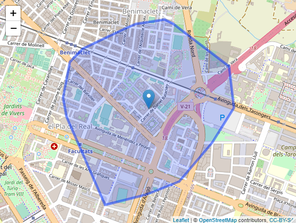
```

---

# Áreas de influencia: [Cartociudad](https://www.cartociudad.es/portal/) 

```{r, eval = FALSE}
#   Área de influencia a partir de la red de Cartociudad
cartociudad_get_area <- function(longitud, latitud, distancia, plot = FALSE)
```

```{r, echo = FALSE, eval = TRUE, out.width = "70%", fig.align = "center"}
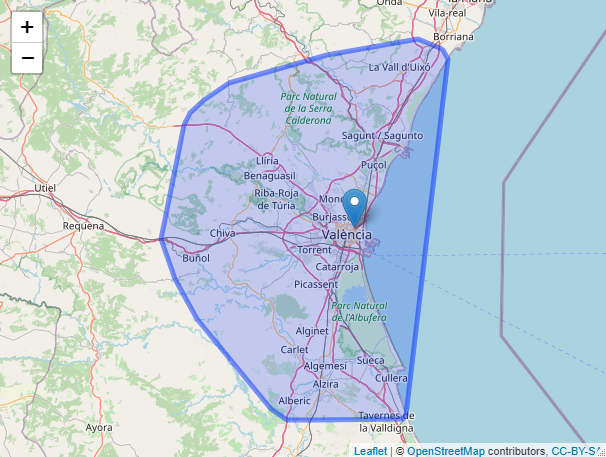
```

---

# Áreas de influencia: Monografía accesibilidad

- ¿Cómo se generaron las áreas de influencia en la monografía de accesibilidad?

<br>

--

- Dos casos:

 1. Si el **municipios tiene oficina**, el **área de influencia** es el propio **término municipal**.

--

 1. Si el **municipio no tiene oficina**, el **área de influencia** viene determinada por un número determinado de **municipios vecinos**, entendidos como otros municipios con contigüidad física, con oficinas.

---

# Municipios **con** Oficina

.pull-left[ 

```{r, echo = FALSE, eval = TRUE, out.width = "80%", fig.align = "center"}
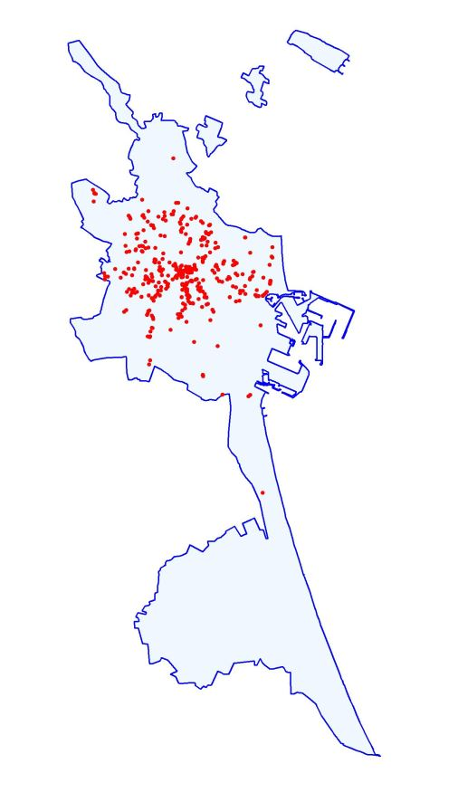
```

]

.pull-right[ 
- En el caso de los **municipios con oficina** se calcularán distancias y tiempos a todas las oficinas del término municipial, que constituye su propia área de influencia.

<br>

- El **supuesto implícito** es que el acceso es a las oficinas del propio término municipal, de forma que no buscamos oficinas en otros municipios.

]

---

# Municipios **sin** Oficina

- En el caso de los **municipios sin oficina** el umbral de municipios vecinos en los que buscar la oficina más cercana se fijó en 20.

- El **supuesto implícito** es que la oficina más cercana está en los 20 vecinos más próximos que tienen oficina.

--

- La búsqueda de vecinos se hace por contiguidad física del término municipal, iterativamente a partir de la contigüidad de primer orden, hasta completar al menos 20 vecinos con oficinas.

- El algoritmo de búsqueda implica que tendremos, como mínimo, 20 municipios vecinos &ndash;de un orden de contigüidad no identificado a priori&ndash; con oficina, y al menos 20 candidatos &ndash;oficinas&ndash;, pero normalmente muchos más.

---

# ¿Como buscamos los vecinos?

- A partir del mapa de contornos municipales una función hace el trabajo:

```{r, eval = FALSE}
# Given a POLYGON or MULTIPOLYGON sf and a primary key,
# it generates a list with the neighboring codes.
neighbor_codes <- function(poly, variable, type = c('queen', 'rook', 'bishop')) {
```

<br>

- Existen varios tipos de contigüidad, _queen_, _rook_ y _bishop_, y consideramos el menos restrictivo.

```{r, echo = FALSE, eval = TRUE, out.width = "80%", fig.align = "center"}
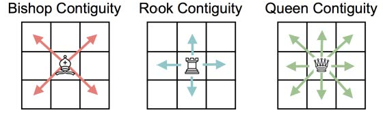
```

---

# Visualmente: Municipio **sin** oficina

```{r, echo = FALSE, eval = TRUE, out.width = "90%", fig.align = "center"}
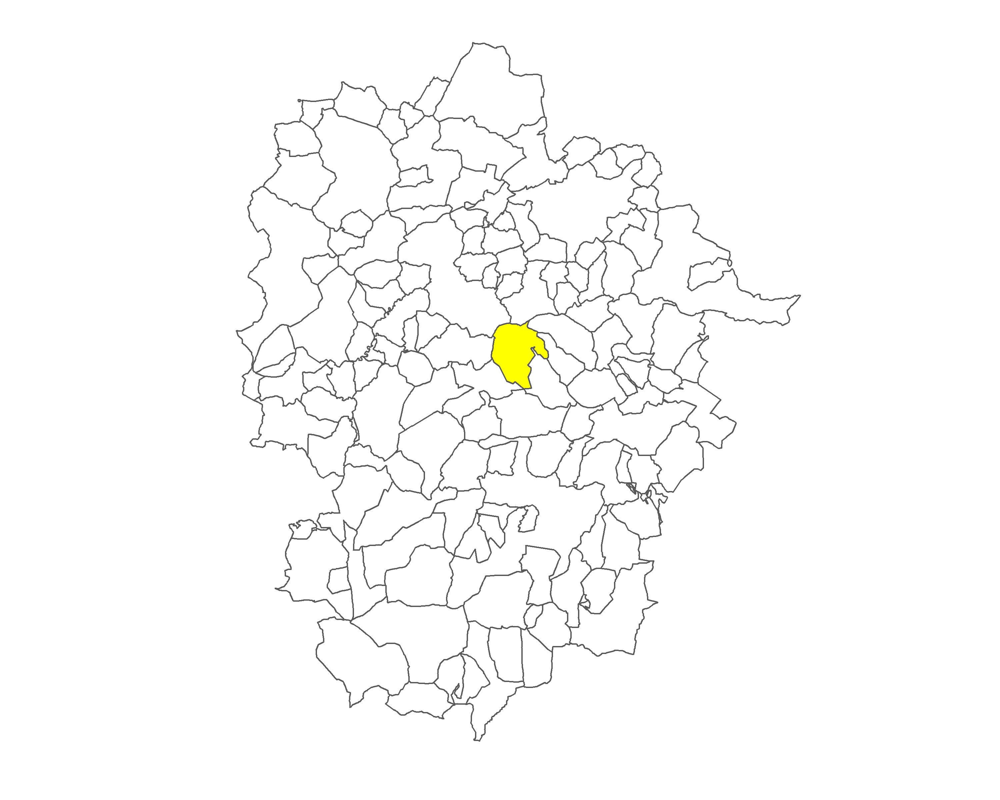
```

---

# Vecinos de **primer orden**

```{r, echo = FALSE, eval = TRUE, out.width = "90%", fig.align = "center"}
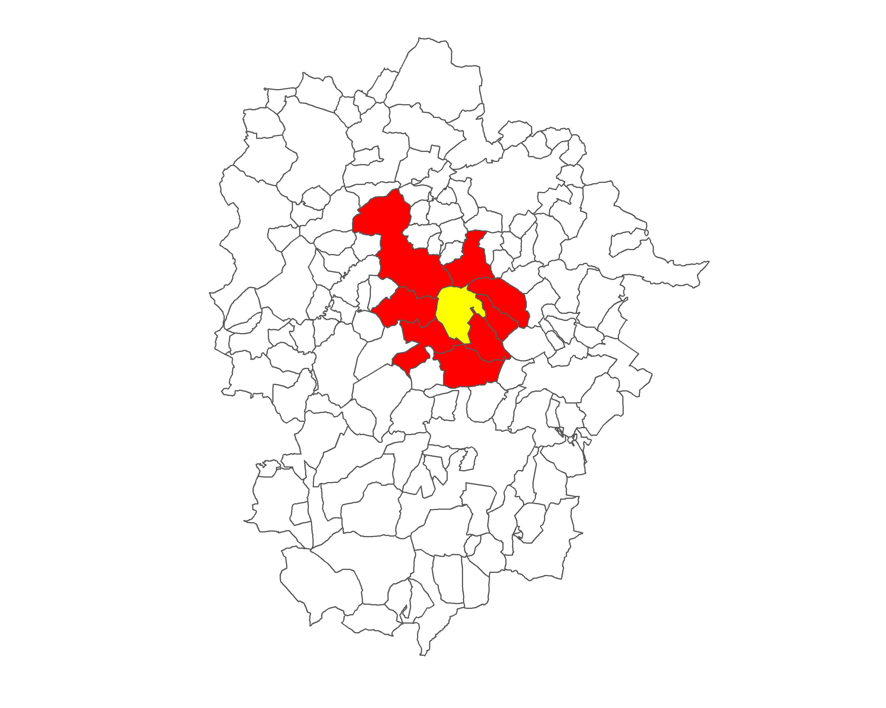
```

---

# Vecinos de **segundo orden**

```{r, echo = FALSE, eval = TRUE, out.width = "90%", fig.align = "center"}
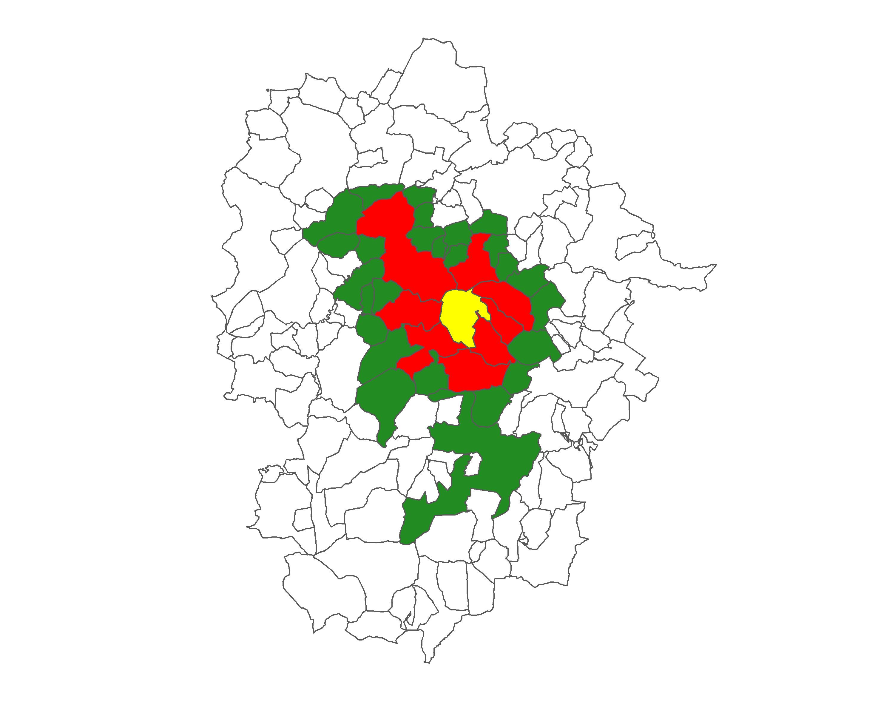
```

---

# Vecinos de **tercer orden**

```{r, echo = FALSE, eval = TRUE, out.width = "90%", fig.align = "center"}
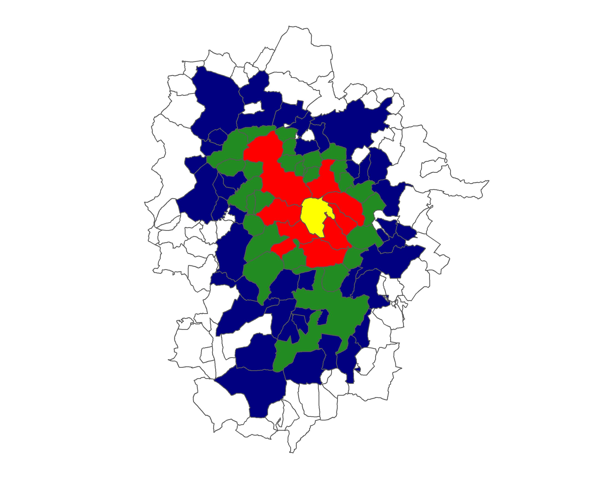
```

---

# ¡Solo si tienen oficina cuentan en el umbral!

```{r, echo = FALSE, eval = TRUE, out.width = "90%", fig.align = "center"}
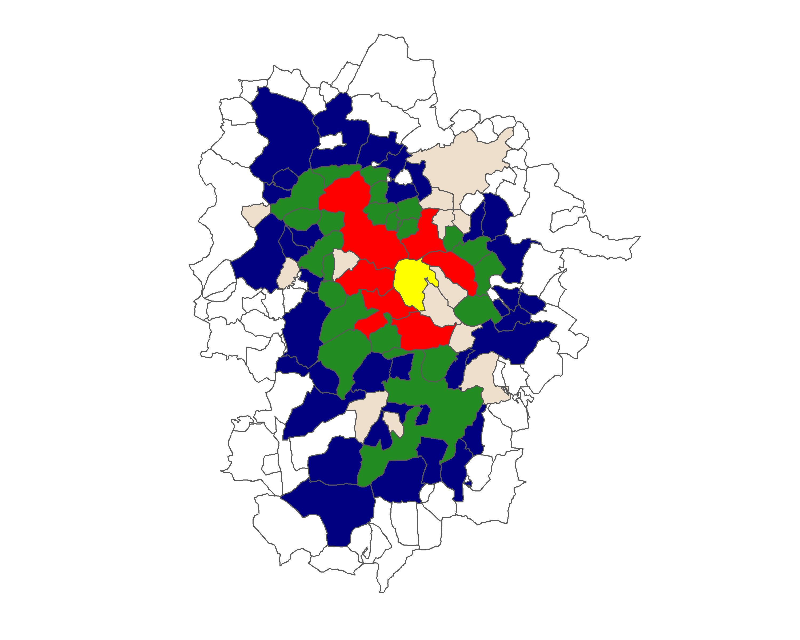
```

---

# Municipio y su área de influencia

```{r, echo = FALSE, eval = TRUE, out.width = "90%", fig.align = "center"}
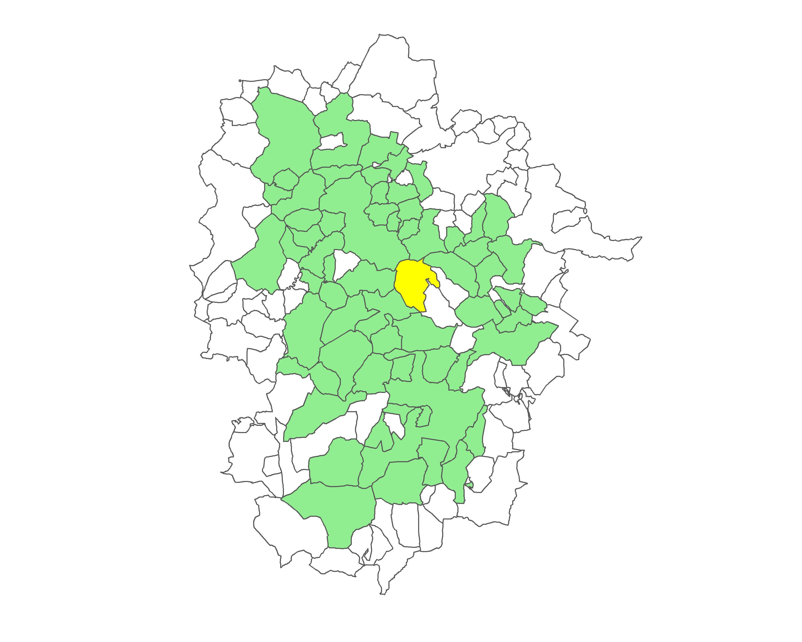
```

---

# Distancias y tiempos.

- Una vez tenemos **orígenes** &ndash;municipios&ndash; y **destinos** candidatos &ndash;oficinas&ndash; estamos en disposición de calcular **distancias** y **tiempos de viaje**.

- Para ello necesitamos una **red de carreteras** con los atributos correspondientes. Básicamente la longitud y velocidad de cada tramo.

- La longitud se puede medir sobre la propia red.

- El tiempo de viaje necesita supuestos sobre velocidades &ndash;reales o teóricas&ndash; del medio de transporte.

- La **ruta óptima** entre 2 puntos es un problema estándar en GIS, se resuelve mediante alguna variante del [algoritmo de Dijkstra](https://en.wikipedia.org/wiki/Dijkstra%27s_algorithm) y está implementado en cualquier _software_ o libraría de GIS que tenga funcionalidades de redes ([sfnetwroks](https://luukvdmeer.github.io/sfnetworks/index.html)). ¡Esto **no** es un problema!

---

# Distancias y tiempos.

- Existen 2 posibilidades para llevar a cabo este tipo de cálculos:

.pull-left[ 
.red[**Red en local**]

1. Costosa de cargar y mantener.

1. ¿Atributos?

1. Requiere sistemas de cálculo medianos.

1. Permite contrafactuales.

1. Resultados replicables.

1. ¡Controlamos la red!
]

--

.pull-right[ 
.red[**Red en remoto**]

1. Acceso mediante **API**.

1. No necesitamos realmente la red física.

1. No requiere grandes sistemas.

1. No permite contrafactuales.

1. ¿Replicabilidad?

1. ¡No controlamos la red!
]

---

# Red Local: IGN - Redes de Transporte

.pull-left[ 

```{r, echo = FALSE, eval = TRUE, out.width = "80%", fig.align = "center"}
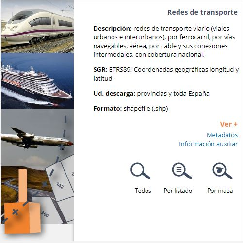
```
]

.pull-right[ 

1. Información Geográfica de Referencia.

1. Fuente oficial (IGN).

1. Multimodal (¡pero podemos coger lo que necesitemos!).

1. Carece de atributos.

1. ¡Controlamos la red!

1. Costosa de implementar y mantener.

1. ¡Gratuita!
]

---

# Red Local: TomTom - [_Speed Profile_](https://www.tomtom.com/products/speed-profiles/)

.pull-left[ 

```{r, echo = FALSE, eval = TRUE, out.width = "100%", fig.align = "center"}
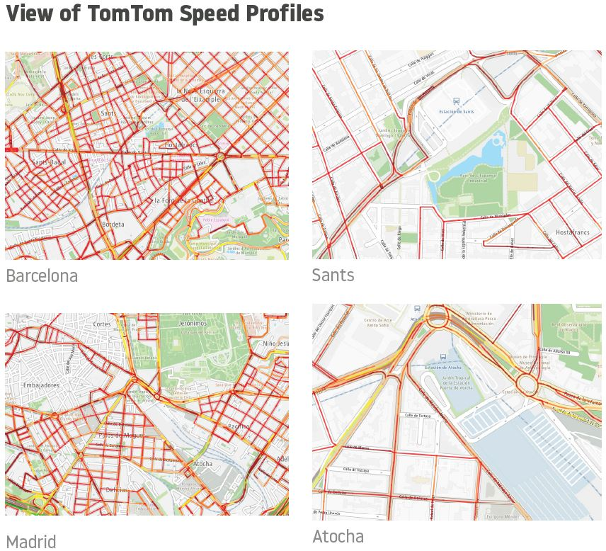
```
]

.pull-right[ 

1. Elevada calidad y resolución.

1. Rica en atributos.

1. ¡Datos de tráfico reales! y por cortes diarios y temporales.

1. Unimodal.

1. ¡Controlamos la red!

1. Sencilla de implementar y mantener.

1. Elevado coste.
]

---

# Red remota: ¿Alternativas?

- Enviamos los orígenes y destinos a un servicio de _routing_. El mundo de los servicios tiene _pros_ y _cons_, pero resulta más sencillo que el mantenimiento de una red en local.

- Opción elegida para la monografía de accesibilidad.

### [Cartociudad](https://www.cartociudad.es/portal/) _versus_ [Google](https://cloud.google.com/maps-platform)

.pull-left[
**Cartociudad**

1. Cobertura nacional.

1. Servicio gratuito e ¡**ilimitado**!

1. Documentación de la [API](http://www.cartociudad.es/recursos/Documentacion_tecnica/CARTOCIUDAD_ServiciosWeb.pdf).

1. No es fiable en tiempos de viaje en coche.
]

.pull-right[
**Google**

1. Cobertura mundial.

1. Servicio de pago y ¡**limitado**!

1. Documentación de la [API](https://developers.google.com/maps/documentation/distance-matrix/overview).

1. Fiable en distancias y tiempos.
]

---

# [Cartociudad](https://www.cartociudad.es/portal/) _versus_ [Google](https://cloud.google.com/maps-platform): Distancias

```{r, echo = FALSE, eval = TRUE, out.width = "75%", fig.align = "center"}
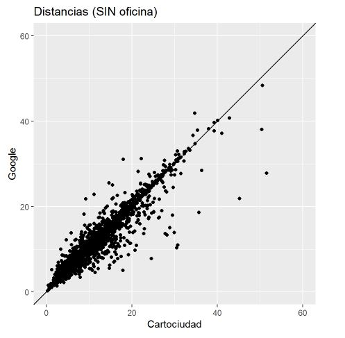
```

???

Las distancias entre ambos servicios son ok. Correlación 0.96.

---

# [Cartociudad](https://www.cartociudad.es/portal/) _versus_ [Google](https://cloud.google.com/maps-platform): Tiempos

```{r, echo = FALSE, eval = TRUE, out.width = "75%", fig.align = "center"}
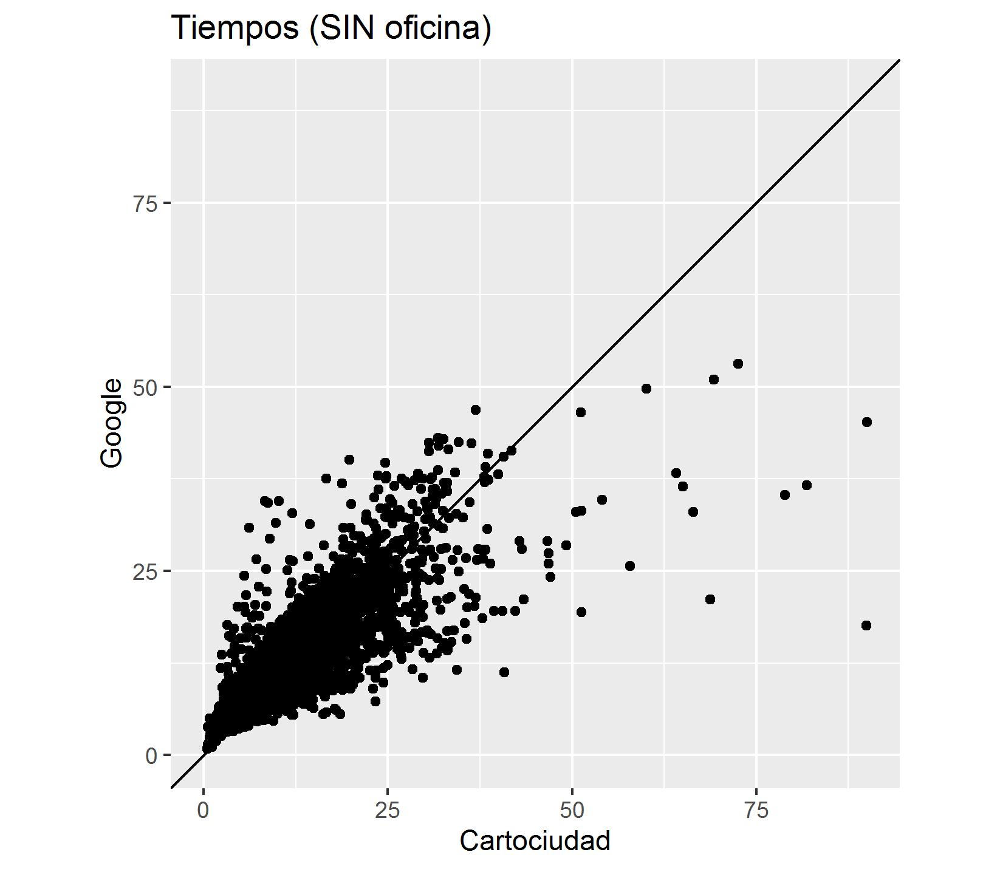
```

???

Los tiempos de Cartociudad son en algunos casos superiores a los de Google. Correlación 0.81.

---

# Monografía accesibilidad

- Dada la mayor fialibilidad de Google, pero al mismo tiempo su elevado coste para un gran número de consultas se implementó una estrategia en dos etapas<sup>*</sup>:

1. Todos los candidatos determinados en el **área de influencia** se enviaron a Cartociudad: ¡Unas 600 000 rutas y un par de días de cálculo!

2. A partir de las rutas para todos los candidatos se hizo una **selección por distancia** que se envió a Google: Las **4 oficinas** más cercanas de **4 municipios diferentes**.

<br>

Se enviaron a Google, además, todas las rutas que Cartociudad no encuentra, ¡porque Cartociudad no lo encuentra todo!

.footnote[(*) Para los municipios con oficina se enviaron a Google todas las oficinas del municipio.]

---

# _Routing_ Cartociudad: Funciones

```{r, eval = FALSE}
# Distancia y Tiempo de Viaje entre 2 puntos (coordenadas)
cartociudad_get_distance <- function (from, to, vehicle = c("car", "walk"))

#  Distancia y Tiempo de Viaje entre 2 vectores de coordenadas
cartociudad_distance <- function(from, to, vehicle = c("car", "walk"), progress = TRUE)
```

- `cartociudad_get_distance()`: ruta única entre 2 puntos (coordenadas) en ETRS89.

- `cartociudad_distance()`: rutas masivas _pairwise_ entre 2 vectores de puntos (coordenadas), o entre un origen y múltiples destinos o entre múltiples orígenes y un destino en ETRS89.

Calcula rutas en coche o a pie.

En ambos casos devuelve un `tibble` con la distancia (en metros), el tiempo de viaje (en segundos) y una variable de _status_: `OK` o `NOT_FOUND`.

---

# _Routing_ Google: Funciones

```{r, eval = FALSE}
# Distancia y Tiempo de Viaje entre 2 puntos (coordenadas)
google_get_distance <- function (from, to, mode = c("driving", "walking", "bicycling", "transit"), key = NULL)

#  Distancia y Tiempo de Viaje entre 2 vectores de coordenadas
google_distance <- function(from, to, mode = c("driving", "walking", "bicycling", "transit"), key = NULL, progress = TRUE)
```

- `google_get_distance()`: ruta única entre 2 puntos (coordenadas) en WGS84.

- `google_distance()`: rutas masivas _pairwise_ entre 2 vectores de puntos (coordenadas), o entre un origen y múltiples destinos o entre múltiples orígenes y un destino en WGS84.

Calcula rutas en coche, a pie, en bicicleta o multimodales.

Los resultados dependen (marginalmente) del momento de la consulta, porque Google dispone información de tráfico por franjas horarias y días.

En ambos casos devuelve un `tibble` con la distancia (en metros), el tiempo de viaje (en segundos) y una variable de _status_: `OK` o `NOT_FOUND`.

---

# ¿Hay alternativas a [Cartociudad](https://www.cartociudad.es/portal/) o [Google](https://cloud.google.com/maps-platform)?

##<center>.green[**Sí.**]<center/>

###<center>[Google](https://cloud.google.com/maps-platform) tiene versión _OpenSource_ : [Open Street Maps](https://www.openstreetmap.org/#map=6/40.007/-2.488), (OSM).<center/>

- La información de [OSM](https://www.openstreetmap.org/#map=6/40.007/-2.488) es accesible mediante [**API**](https://wiki.openstreetmap.org/wiki/Main_Page) o descarga directa.

- La información se actualiza diariamente: [Geofabric](https://www.geofabrik.de/).

- Dispone de un servicio de geocodificación: [Nominatim](https://nominatim.org/).

- Dispone de un servicio de _routing_: [OSRM](http://project-osrm.org/).

- ¡Es posible instalar [OSM](https://www.openstreetmap.org/#map=6/40.007/-2.488) en local! ¡En el [Ivie](https://www.ivie.es/es_ES/) hay un servidor de [OSM](https://www.openstreetmap.org/#map=6/40.007/-2.488)!

- ¡Es (monetariamente) gratis!

- Hay librerías de [_R_](https://cran.r-project.org/) que acceden a todo: datos, geocodificación, _routing_,... en remoto o en local.


---

# Oficinas díscolas (2/3)

- Se hicieron búsquedas manuales en Google y en los buscadores de las oficinas de cada entidad.

- Ello permitió corregir numerosos errores del fichero original del Banco de España<sup>*</sup>.

- Rebajando la precisión de la coordenada devuelta por Cartociudad, `state = 6`, se geocodificó 1 oficina más.

```{r, eval = FALSE}
# 06Oficinas_Carto4.R
g <- cartociudad_geocode(Oficinas$ndir[i], ver = "current", progress = FALSE)
  if (g$state == 6) # Aceptamos la coordenada con menor precisión #<<
```

- Se mantuvo el criterio de que todas las coordenadas debían "caer" en el término municipal de acuerdo con el mapa del IGN. ¡Aún a sabiendas de que el mapa no es perfecto y contiene errores!


.footnote[(*) Esto se hizo en iteraciones anteriores del proceso.]

---

# Oficinas díscolas (3/3)

- Finalmente, para 32 oficinas, se asignó la **coordenada de la Capital del Municipio**<sup>*</sup>.

Lo que cierra el proceso (iterativo) de georeferenciación.

<br/>

----

.footnote[(*) Esta información procede del Nomenclátor geografico del IGN y se comprobó que las coordenadas caen donde deben hacerlo.]

--

<br/>

- La distribución final del origen de las coordenadas es


---

# Comprobaciones finales

Es **importante** realizar **dos comprobaciones finales**:

- Comprobar que **todas las coordenadas caen dentro de la precisión espacial fijada** en la estrategia inicial<sup>*</sup>.

```{r, eval = FALSE}
# 07Oficinas_final.R
OfiMuni <- Oficinas %>%
  st_as_sf(coords = c("Longitud", "Latitud"), crs = 4258) %>%
  st_intersection(Municipios2020)  # Una interseción espacial hace el trabajo #<<
sum(OfiMuni$CodMuni != OfiMuni$INECodMuni)
```

.footnote[(*) Si hay excepciones se deberá dejar registro de ello.]

--

- Comprobar **duplicados por coordenada**. Muy útil para detectar errores. 

```{r, eval = FALSE}
# 07Oficinas_final.R
duplicados <- Oficinas %>%
  janitor::get_dupes(CodMuni, Municipio, CodEnt, Entidad, Longitud, Latitud) #<<
```

---

class: inverse, center, middle

# ¿Para que sirve todo esto?

---

### Para pintar oficinas en el mapa...

```{r echo = FALSE, out.width = "100%", fig.height = 6, eval = require("leaflet")}
leaflet(Oficinas) %>% addTiles() %>% setView(lng = -0.3559, lat = 39.4805, zoom = 18) %>%
  addMarkers(lng = -0.3559, lat = 39.4805, icon = IvieIcon) %>%
  addMarkers(clusterOptions = markerClusterOptions(), popup = ~ Entidad)
```

---
background-image: url(https://www.ivie.es/wp-content/uploads/2017/02/logo.jpg), url(https://www.uv.es/recursos/fatwirepub/css/logoPeu.png)
background-position: 95% 5%, 5% 95%
background-size: 12%, 20%

class: center, middle


# ¡Gracias por la atención!

## .green[¿Preguntas?]

???

Slides created via the R package [**xaringan**](https://github.com/yihui/xaringan).

